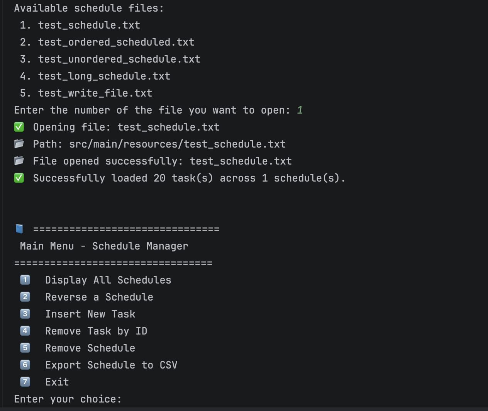
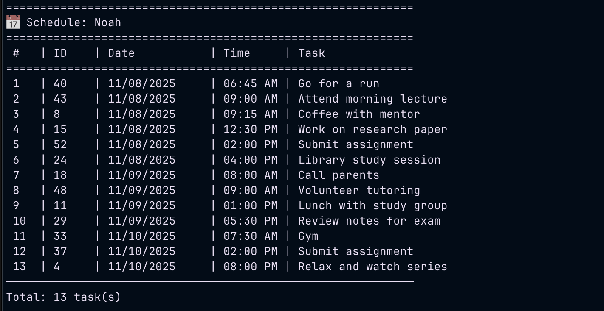

# 🗓️ Schedule Manager

A simple, command-line Java application for managing schedules and tasks.  
This project allows users to create, view, modify, and export multiple schedules from text or CSV files.  
Each schedule contains tasks that are automatically sorted by date and time.

---
## 🖼️ Demo
### 💻 Program Demo
This screenshot shows the Schedule Manager running in the terminal interface:



---

### 📋 Schedule Display
Here’s an example of how the program displays and organizes schedules automatically by date and time:



---

## 🚀 Features

- 📂 **Create and load** schedule files (`.txt`)
- 📝 **Add, remove, and display** tasks interactively
- 🕒 **Sort tasks** automatically by date and time
- ⚠️ **Detect schedule conflicts** (duplicate date/time entries)
- 🔁 **Reverse** task order within a schedule
- 💾 **Export schedules** to CSV format
- 🧹 Clean, minimal, and easy-to-use command-line interface

---

## 🧩 Project Structure

```
schedule-manager/
├── pom.xml                  # Maven project configuration
├── .gitignore               # Git ignore rules
├── README.md                # Project documentation
└── src/
    ├── main/
    │   ├── java/
    │   │   ├── Main.java       # Entry point (program starts here)
    │   │   ├── Manager.java    # Handles all schedule operations
    │   │   ├── Schedule.java   # Linked list structure for tasks
    │   │   └── Item.java       # Represents a single task node
    │   └── resources/          # Contains schedule test data
    └── test/
        └── java/               # (optional) unit test folder
```

---

## 🧰 Requirements

- **Java 17+** (tested on Java 25)
- **Apache Maven 3.8+**

---

## ⚙️ How to Build & Run

### 1️⃣ Clone the repository
```bash
git clone https://github.com/nsubba27/schedule-manager.git
cd schedule-manager
```

### 2️⃣ Compile the project
```bash
mvn clean compile
```

### 3️⃣ Run the application
```bash
mvn exec:java -Dexec.mainClass="Main"
```

---

## 💾 File Storage

All schedule data files are stored inside:
```
src/main/resources/
```
Each file can be in either `.txt` or `.csv` format.  
When you start the app, you can choose to open an existing file or create a new one.

Example:
```
📁 new_test.csv
📁 test_schedule.txt
📁 test_ordered_schedule.csv
```